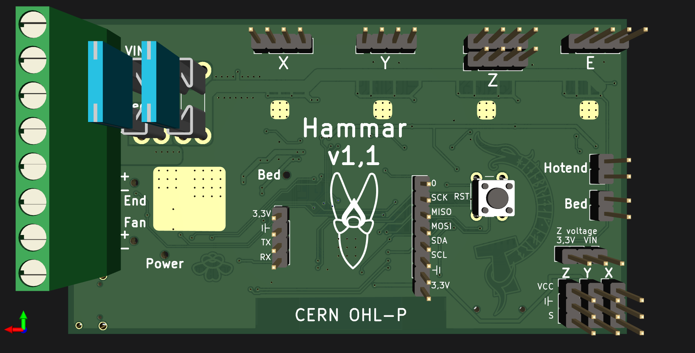
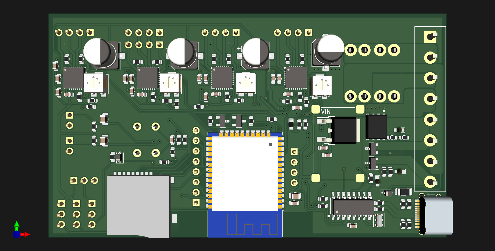

This board is untested. Make at your own risk.

Based on the ESP wroom-32E, which also enables wifi communication.
Total size is only 97,5x55mm

Still in development, but should be functional. Use with the fysetc E4 config in marlin
